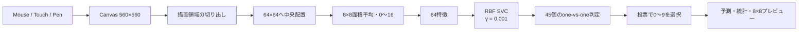
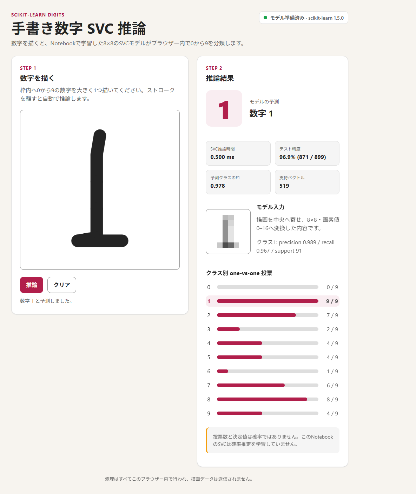
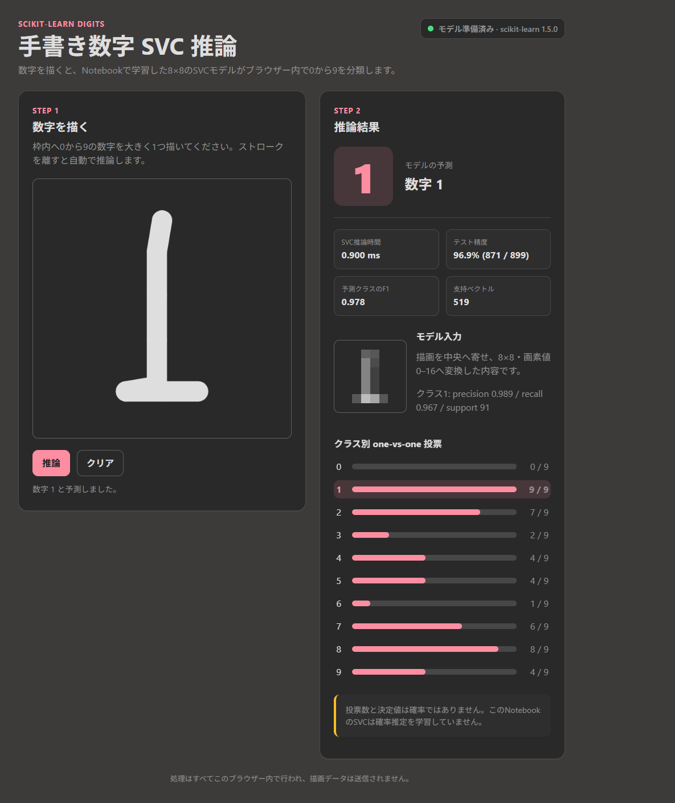
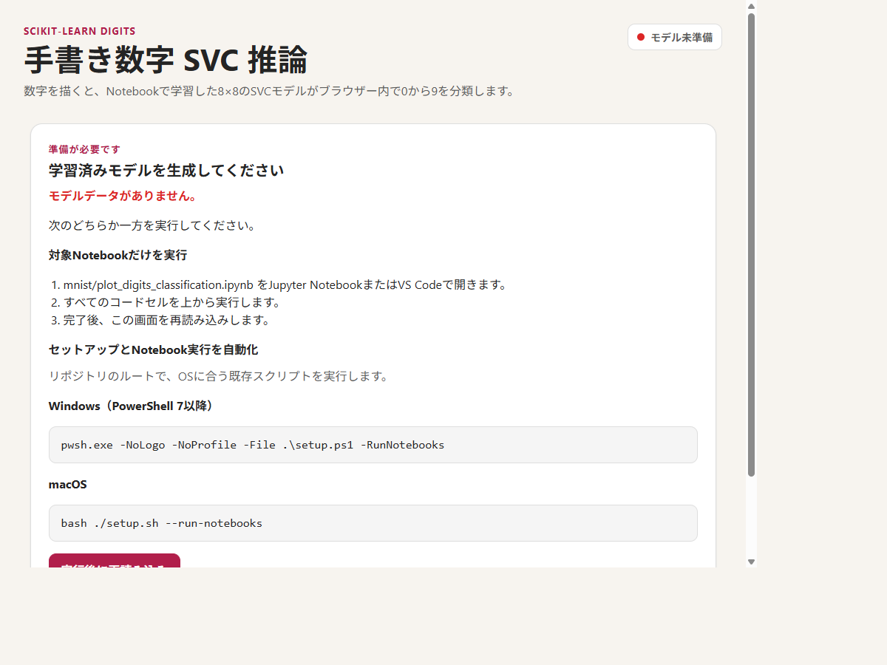

# 手書き数字 SVC 推論システムテストレポート

- **実施日**: 2026-08-28
- **対象**: `mnist/plot_digits_predition.html`
- **対象SHA-256**: `A06B5BF5F55418B52DDB8771981B3FDA45554CC7E0654F406F33C77DFB9CF37B`
- **対象サイズ**: 238,209 bytes
- **要求受入判定**: **PASS（11/11、合成Pointer Eventによる自動試験の範囲）**。物理タッチ・ペン、macOS、Safari、Firefox、Edge単体は未検証である。[E2][E3][E4]
- **想定用途判定**: **教育用のローカルデモとして利用可能**。[R1][R4]
- **一般的な本番ML推論システムとしての判定**: **条件付き／未準備**。実利用者の手書きデータによる外部評価、OOD拒否、物理端末・複数ブラウザー試験、継続監視、モデル署名・ロールバックがないため、高リスク用途や本番サービスへの適合は確認していない。[E1][E3][E6][N2][N3][N4]

## 1. テスト方針

NIST AI RMFは、AIシステムの用途・利用文脈・知識限界を文書化し、テストセット、指標、TEVV（test, evaluation, validation, verification）ツール、妥当性・信頼性、堅牢性、安全性、セキュリティ、プライバシー、公平性、監視、残余リスクを記録することを挙げている。[N1][N2][N3][N4] 本レポートは、この推論サブシステムに該当する項目を次の状態で網羅した。

- **PASS**: 判定条件を実測で満たした。
- **PARTIAL**: 一部を実測したが、一般的な本番要件を満たすには試験または実装が不足する。
- **OBSERVED**: 挙動を測定したが、合否基準が要求にない。
- **LIMITATION**: 実装されていない、または一般化できない制約を確認した。
- **NOT TESTED**: 現在の環境またはテスト手段では検証していない。
- **N/A**: この単一ファイル・ローカル推論の構成には適用されない。

NIST Playbook自身も、全項目を一律に実施するチェックリストではなく、用途に応じて選択する任意の指針としている。[N1]

## 2. システム構成

実装はCanvasのalpha値を使って描画領域を検出し、8×8へ縮小した64整数特徴を、HTML内へ埋め込んだSVCパラメーターで推論する。[R3] Canvas APIはJavaScriptによる2D描画・画像処理を提供し、Pointer Eventsはマウス、ペン、タッチを共通の入力モデルで扱う。[W1][W2]

## 3. テスト環境

| 項目 | 実測値 | 出典 |
|---|---:|---|
| OS | Microsoft Windows 10.0.29648 / x64 | [E7] |
| 論理CPU | 20 | [E7] |
| ブラウザー | VS Code 1.135.0 / Electron 42.8.1 / Chrome 148.0.7778.280 | [E2] |
| ブラウザー言語 | `ja` | [E2] |
| `navigator.deviceMemory` | 32 GB | [E2] |
| `navigator.maxTouchPoints` | 10 | [E2] |
| Python | 3.12.3 | [E1] |
| NumPy | 2.5.2 | [E1] |
| scikit-learn | 1.5.0 | [E1] |
| デスクトップ試験幅 | 1200×900 CSS px | [E2] |
| 狭幅試験 | 390×844 CSS px（レイアウト計測のみ） | [E2] |
| 起動方式 | `file://` | [E2] |

性能値はこの環境での実測であり、他のPC、Mac、ブラウザー、電源状態へ一般化しない。[E2][P1]

## 4. 画面証跡

### 4.1 正常系・ライトテーマ

合成マウスストロークで「1」を描き、自動推論後に予測、推論時間、テスト精度、F1、支持ベクトル数、8×8入力、10クラスの投票を表示した状態。[E3]

### 4.2 正常系・ダークテーマ

合成ペンストロークで「1」を描いた状態。ライトテーマと同じ予測・統計項目が表示された。[E3]

### 4.3 異常系・モデル未準備

ディスク上のHTMLは変更せず、ページメモリ上でモデルJSONを`null`に置換した障害注入結果。通常の推論UIを隠し、Notebook実行方法と再読み込み操作を表示した。[E3]

## 5. データ・モデル・成果物

### 5.1 データ契約

`load_digits()` は10クラス、1,797件、8×8画像、64特徴、特徴値0〜16のデータセットである。[S1] 現行Notebookは `test_size=0.5, shuffle=False` で分割する。[R2]

| 項目 | 実測値 | 判定 | 出典 |
|---|---:|---|---|
| 全サンプル | 1,797 | PASS | [E1][S1] |
| 学習サンプル | 898 | PASS | [E1] |
| テストサンプル | 899 | PASS | [E1] |
| 画像形状 | 8×8 | PASS | [E1][S1] |
| 特徴数 | 64 | PASS | [E1][S1] |
| 特徴値域 | 0〜16 | PASS | [E1][S1] |
| 学習クラス件数 | `[90, 91, 91, 92, 89, 91, 90, 90, 86, 88]` | OBSERVED | [E1] |
| テストクラス件数 | `[88, 91, 86, 91, 92, 91, 91, 89, 88, 92]` | OBSERVED | [E1] |
| 学習・テスト間の完全一致64特徴 | 0件 | PASS（完全重複のみ） | [E8] |

完全一致が0件でも、近似重複、収集過程の相関、その他のデータ漏えいがないことまでは証明しない。[E8]

評価は同じ組み込みDigitsデータを順序どおりに1回だけ分割したもので、交差検証、独立外部テスト、ラベル品質監査は実施していない。また、学習は元の8×8画像、実利用はCanvas描画を独自前処理した8×8画像であり、両入力分布の差を実利用者データで評価していない。[R2][R3][E1][N2]

### 5.2 モデル契約

scikit-learnのSVCは多クラスを内部でone-vs-oneとして扱い、`dual_coef_` は `(n_classes - 1, n_SV)`、`support_vectors_` は `(n_SV, n_features)`、`intercept_` はクラス対の個数、`n_support_` はクラス数の形状を持つ。[S2]

| 項目 | 埋め込み値 | 参照モデル照合 | 出典 |
|---|---:|---|---|
| モデル | `sklearn.svm.SVC` | 一致 | [E1][R2][R3] |
| カーネル | RBF | 一致 | [E1] |
| `gamma` | 0.001 | 一致 | [E1][R2] |
| クラス | 0〜9 | 一致 | [E1] |
| 特徴数 | 64 | 一致 | [E1] |
| 支持ベクトル | 519 | 一致 | [E1] |
| クラス別支持ベクトル | `[34, 64, 55, 52, 43, 50, 35, 56, 65, 65]` | 一致 | [E1] |
| `support_vectors_` 形状 | 519×64 | 完全一致 | [E1] |
| `dual_coef_` 形状 | 9×519 | 完全一致 | [E1] |
| `intercept_` 形状 | 45 | 完全一致 | [E1] |
| `n_support_` | 10件 | 完全一致 | [E1] |
| モデルスキーマ | 1 | 検証成功 | [E1][R3] |
| 埋め込みscikit-learn版 | 1.5.0 | 参照実行環境と一致 | [E1] |

### 5.3 成果物完全性

| 項目 | 実測値 | 出典 |
|---|---:|---|
| HTML | 238,209 bytes | [E1][E7] |
| HTML SHA-256 | `A06B5BF5F55418B52DDB8771981B3FDA45554CC7E0654F406F33C77DFB9CF37B` | [E1][E7] |
| モデルJSON | 203,410 bytes | [E1] |
| モデルJSON比率 | 85.391% | [E1] |
| モデルJSON SHA-256 | `C639E5A0E28E08459B7BCE13FEE0DFFD8954CB737FE3306D194103E6B97CADEC` | [E1] |
| Notebook再実行後のHTMLハッシュ | 変更なし | PASS | [E5] |
| 同条件で3回学習したモデル配列・予測 | 全て一致 | PASS | [E1] |

SHA-256は今回試験したファイルを識別する証跡であり、署名や信頼された配布経路を提供するものではない。[E1]

## 6. 参照一致とモデル品質

### 6.1 PythonとJavaScriptの一致

- HTML内の実際の `predictSVC` をテスト時だけ公開し、テスト899件へ適用した。
- Python `clf.predict()` との差異は **0 / 899** だった。
- 支持ベクトル、双対係数、切片、クラス別支持ベクトル数はPython参照モデルと要素単位で完全一致した。[E1][E2]

**判定: PASS**。これはブラウザー移植の数値忠実度を示す。未知の手書き入力に対する正解率を示すものではない。[E1][E2]

### 6.2 精度と不確実性

`accuracy_score` は正しく分類したサンプルの割合を返す。[S5] Wilson法による比率の信頼区間はNIST Engineering Statistics Handbookの式を使用した。[N5]

| 指標 | 実測値 | 出典 |
|---|---:|---|
| 正解 | 871 / 899 | [E1] |
| 誤分類 | 28 / 899 | [E1] |
| Accuracy | 0.968854（96.885%） | [E1] |
| Accuracy 95% Wilson区間 | 95.535%〜97.836% | [E1][N5] |
| Macro Precision | 0.969698 | [E1] |
| Macro Recall | 0.969176 | [E1] |
| Macro F1 | 0.968874 | [E1] |
| Weighted F1 | 0.968664 | [E1] |

この区間は、この単一固定分割の899件を二項試行として扱う精度比率の区間であり、分割方法の不確実性、サンプル間依存、Canvas前処理後の手書き分布、将来データへの一般化を表さない。[R2][R3][E1][N5]

### 6.3 クラス別指標

`classification_report` はクラス別precision、recall、F1、supportを返す。[S3]

| 数字 | Precision | Recall | F1 | Support |
|---:|---:|---:|---:|---:|
| 0 | 1.0000 | 0.9886 | 0.9943 | 88 |
| 1 | 0.9888 | 0.9670 | 0.9778 | 91 |
| 2 | 0.9884 | 0.9884 | 0.9884 | 86 |
| 3 | 0.9753 | 0.8681 | 0.9186 | 91 |
| 4 | 0.9888 | 0.9565 | 0.9724 | 92 |
| 5 | 0.9462 | 0.9670 | 0.9565 | 91 |
| 6 | 0.9890 | 0.9890 | 0.9890 | 91 |
| 7 | 0.9565 | 0.9888 | 0.9724 | 89 |
| 8 | 0.9362 | 1.0000 | 0.9670 | 88 |
| 9 | 0.9278 | 0.9783 | 0.9524 | 92 |

出典: [E1][S3]

- 最低Recallは数字3の0.8681、最高Recallは数字8の1.0000で、差は13.19ポイントだった。[E1]
- 最低F1は数字3の0.9186、最高F1は数字0の0.9943で、差は7.57ポイントだった。[E1]
- これは数字クラス間の性能差であり、人口統計上の公平性評価ではない。[E1][N2]

### 6.4 混同行列

混同行列は、行が正解クラス、列が予測クラスの件数である。[S4]

| 正解＼予測 | 0 | 1 | 2 | 3 | 4 | 5 | 6 | 7 | 8 | 9 |
|---:|---:|---:|---:|---:|---:|---:|---:|---:|---:|---:|
| 0 | 87 | 0 | 0 | 0 | 1 | 0 | 0 | 0 | 0 | 0 |
| 1 | 0 | 88 | 1 | 0 | 0 | 0 | 0 | 0 | 1 | 1 |
| 2 | 0 | 0 | 85 | 1 | 0 | 0 | 0 | 0 | 0 | 0 |
| 3 | 0 | 0 | 0 | 79 | 0 | 3 | 0 | 4 | 5 | 0 |
| 4 | 0 | 0 | 0 | 0 | 88 | 0 | 0 | 0 | 0 | 4 |
| 5 | 0 | 0 | 0 | 0 | 0 | 88 | 1 | 0 | 0 | 2 |
| 6 | 0 | 1 | 0 | 0 | 0 | 0 | 90 | 0 | 0 | 0 |
| 7 | 0 | 0 | 0 | 0 | 0 | 1 | 0 | 88 | 0 | 0 |
| 8 | 0 | 0 | 0 | 0 | 0 | 0 | 0 | 0 | 88 | 0 |
| 9 | 0 | 0 | 0 | 1 | 0 | 1 | 0 | 0 | 0 | 90 |

出典: [E1][S4]

最大の単一誤分類は「3→8」の5件で、次いで「3→7」と「4→9」が各4件だった。[E1]

### 6.5 確率・校正・閾値

Notebookは `SVC(gamma=0.001)` を使用し、`probability=True` を指定していない。[R2] scikit-learnでは確率推定を学習時に明示的に有効化する必要があり、内部で追加の5分割交差検証を行う。[S2]

- 画面のone-vs-one投票は**確率ではない**と明示される。[R3][E3]
- 確率校正、信頼度閾値、ROC/PR、ECE/Brier scoreは **N/A（確率出力なし）**。
- OODまたは曖昧入力を棄却する閾値は **未実装**。[E1][E6]

## 7. 入力・前処理・機能

| 試験 | 結果 | 判定 | 出典 |
|---|---|---|---|
| 空入力で推論 | 結果を表示せず「数字を描いてから推論してください」 | PASS | [E3] |
| 出力特徴 | 64件、有限整数、0〜13（試験ストローク） | PASS | [E2] |
| 単一タップ | 64件、0〜16、非ゼロ32件、数字4を返した | OBSERVED | [E6] |
| マウス | 合成ストローク「1」→数字1、投票10行 | PASS | [E3] |
| タッチ | 合成ストローク「1」→数字1、投票10行 | PASS（実機未検証） | [E3] |
| ペン | 合成ストローク「1」→数字1、投票10行 | PASS（実機未検証） | [E3] |
| 非主ポインター | インク0、推論なし | PASS | [E3] |
| 右マウスボタン | インク0、推論なし | PASS | [E3] |
| `pointercancel` | 自動推論せず中断メッセージ | PASS | [E3] |
| 手動再推論 | 同じ数字1と投票10行を表示 | PASS | [E3] |
| クリア | インク0、結果非表示、初期案内を復元 | PASS | [E3] |

8×8への縮小は、64×64の各8×8ブロックについて64個のalpha値を平均し、0〜16へ丸める面積平均として実装されている。[R3]

### 7.1 位置・縮尺ストレス

同じ合成「1」を前処理へ通した結果は次のとおりだった。[E6]

| 変形 | 予測 | 中央版との平均絶対特徴差 | 最大特徴差 |
|---|---:|---:|---:|
| 中央 | 1 | 0 | 0 |
| 右へ移動 | 1 | 0.03125 | 1 |
| 左端へ移動 | 1 | 0 | 0 |
| 60%へ縮小 | 1 | 0.65625 | 4 |

切り出し・中央配置により、この合成例では位置と縮尺が変わっても予測は維持された。これは1種類の合成図形だけの結果であり、一般的な不変性を保証しない。[E6]

## 8. 頑健性・OOD・安全な失敗

### 8.1 モデル破損

`validateModel` へ次の9種類を注入し、全件を拒否した: 不正スキーマ、`gamma=0`、特徴数63、クラス欠落、支持ベクトル行長不正、双対係数行数不正、切片数不正、クラス指標欠落、無限大係数。[E2]

ページ全体の障害注入でも、モデル欠落、JSON構文不正、特徴数不正の3件で通常UIを隠し、モデル未準備メッセージ、復旧手順、再読み込みボタンを表示し、未捕捉ページ例外は0件だった。[E3]

**判定: PASS**。モデル欠落・形式不正はフェイルセーフに処理された。[E2][E3]

### 8.2 入力摂動ストレス

固定seed `20260828` で、元テスト899件へ摂動を加えた。[E9]

| 条件 | Accuracy | ベースラインとの差 |
|---|---:|---:|
| ベースライン | 96.885% | — |
| 整数ノイズ ±1 | 96.663% | -0.223 pt |
| 整数ノイズ ±2 | 96.552% | -0.334 pt |
| 整数ノイズ ±4 | 94.216% | -2.670 pt |
| 画素10%を0 | 92.992% | -3.893 pt |
| 画素20%を0 | 85.095% | -11.791 pt |
| 画素40%を0 | 66.073% | -30.812 pt |
| 1画素上シフト | 53.281% | -43.604 pt |
| 1画素下シフト | 61.068% | -35.818 pt |
| 1画素左シフト | 47.942% | -48.943 pt |
| 1画素右シフト | 49.833% | -47.052 pt |

生の8×8入力は1画素シフトに弱い。ブラウザーUIは描画を切り出して中央配置するため、UIでの平行移動とこの生入力シフト試験は同一条件ではない。[R3][E6][E9]

### 8.3 OOD・棄却

- モデルへ直接入れた全0特徴は数字9、全16特徴とチェッカーボードは数字1を返した。[E1]
- 固定seedの一様ランダム整数ノイズ100件も全件が0〜9のいずれかへ分類され、内訳は数字1が78件、2が7件、5が11件、7が2件、9が2件だった。[E1]
- UIは完全な空白を拒否するが、単一タップは数字4と分類した。[E3][E6]

**LIMITATION**: このSVCは設計上、入力を常に既知の0〜9へ分類する。OOD検出、棄却クラス、最低インク量、校正済み信頼度がないため、対象外入力でも数字を返し、結果を確定的な識別として扱えない。[E1][E6][S2][N2]

## 9. 性能・容量

`performance.now()` は単調増加する高精度タイムスタンプをミリ秒で返す。非cross-origin-isolated環境ではセキュリティ上の理由で分解能が粗くなるため、0.0 msなどの値は「処理時間ゼロ」を意味しない。[P1]

### 9.1 推論性能

| 項目 | 回数 | Min | P50 | P95 | P99 | Max | Mean | 出典 |
|---|---:|---:|---:|---:|---:|---:|---:|---|
| SVC予測関数（前処理・DOM更新を除く） | 3,000 | 0.0 ms | 0.300 ms | 0.700 ms | 1.200 ms | 9.600 ms | 0.353 ms | [E2] |
| 前処理＋SVC＋DOM更新 | 200 | 7.900 ms | 12.650 ms | 22.400 ms | 26.502 ms | 30.200 ms | 13.626 ms | [E2] |

- 初回SVC推論: 1.300 ms。[E2]
- 逐次3,000推論: 1,064.5 ms、**2,818.2 predictions/s**。[E2]
- 100回の同一入力は全て同じラベル8を返した。[E2]

このスループットはUI描画更新を含まない同期・単一サンプルSVC関数の値で、サーバー負荷試験や同時実行性能ではない。[E2]

### 9.2 起動性能

ローカル`file://`を10回読み込み、全10回でモデル準備済みになった。[E2]

| Runs | Min | P50 | P95 | Max |
|---:|---:|---:|---:|---:|
| 10 | 70.0 ms | 112.55 ms | 212.71 ms | 263.2 ms |

出典: [E2]

### 9.3 メモリ・エネルギー

- HTMLとモデルJSONの容量は測定した。[E1]
- ブラウザーのJSヒープ値は10,000,000 bytes単位の粗い同値を返したため、メモリリークやピーク使用量の判定には使用しなかった。[E2]
- 電力・CPU使用率・環境負荷は **NOT TESTED**。[N2]

## 10. 信頼性・回復性・運用

| 項目 | 状態 | 結果 | 出典 |
|---|---|---|---|
| 参照再現性 | PASS | 3回の学習で主要モデル配列と899予測が一致 | [E1] |
| 同一入力決定性 | PASS | 100回でラベル1種類 | [E2] |
| 起動反復 | PASS | 10/10でモデル準備済み | [E2] |
| Notebook正式実行 | PASS | `conda run`経路で全セル完走、519 SV、96.885% | [E5] |
| 成果物再生成 | PASS | HTML SHA-256不変 | [E5] |
| モデル欠落回復案内 | PASS | Notebook／OS別スクリプト／再読み込みを表示 | [E3] |
| ロールバック | LIMITATION | モデル履歴・署名・自動ロールバックなし | [R2][R3] |
| 永続ログ | N/A / LIMITATION | 単一ローカルHTMLのため永続推論ログなし | [R3][E10] |
| ドリフト監視 | LIMITATION | 入力・性能・クラス分布の継続監視なし | [R3][E10][N2][N4] |
| インシデント通知 | LIMITATION | ローカル画面メッセージのみ | [R3][N4] |

補助的に`jupyter.exe`を直接起動した試験では、最初の`!conda env list`だけがPATH上の`conda`を見つけられずstderrを出したが、推論・モデル出力セルは完走した。正式な`conda run`経路では同セルも正常出力した。[E5]

## 11. セキュリティ・プライバシー

| 試験 | 結果 | 判定 | 出典 |
|---|---|---|---|
| 実行時外部リクエスト | 0件 | PASS | [E2] |
| Console error / 未捕捉Page error | 0件 | PASS | [E2] |
| `fetch` / XHR / WebSocket / EventSource / Beacon | ソース内0件 | PASS | [E10] |
| localStorage / sessionStorage / IndexedDB / cookie / Service Worker | ソース内0件 | PASS | [E10] |
| `innerHTML` / `eval` / `new Function` / `document.write` | ソース内0件 | PASS | [E10] |
| 外部`script` / `link` / `img` / `iframe` / media参照 | ソース内0件 | PASS | [E10] |
| 不正モデル | 通常推論を停止し復旧案内 | PASS | [E2][E3] |
| ローカル改ざん防止 | 署名なし | LIMITATION | [E1][R3] |

描画はブラウザー内で処理され、試験中の外部送信・永続保存は観測されなかった。[E2][E10] `file://` originはブラウザーによりopaque originとして扱われ、同じフォルダーの別ファイルでもCORSエラーになり得るため、本実装はモデルをHTMLへ埋め込んでいる。[W3][R3]

この試験は、OS上の別プロセス、ブラウザー拡張、改変済みブラウザーによる読み取りまで防ぐことを証明しない。また、CSP、署名、信頼された配布経路はない。[E1][E10]

## 12. 互換性・UI・アクセシビリティ

### 12.1 互換性と表示

| 試験 | 結果 | 判定 | 出典 |
|---|---|---|---|
| Windows Electron/Chromium `file://` | 起動・推論成功 | PASS | [E2][E3] |
| 1200px幅 | 左右2カラム、横overflowなし | PASS | [E2] |
| 390px幅 | 1カラム、横overflowなし | PASS（座標計測） | [E2] |
| ライトテーマ | 適用成功 | PASS | [E2][E7] |
| ダークテーマ | 適用成功 | PASS | [E2][E7] |
| macOS / Safari | 未実施 | NOT TESTED | [E2] |
| Firefox / Edge単体 | 未実施 | NOT TESTED | [E2] |
| 物理タッチ・物理ペン | 未実施 | NOT TESTED | [E3] |

Pointer EventsとCanvasは主要ブラウザーで広く提供されているが、公式互換表は実機でのアプリ動作を代替しない。[W1][W2]

### 12.2 セマンティクスと操作

| 項目 | 実測 | 判定 | 出典 |
|---|---|---|---|
| 重複ID | 0 | PASS | [E4] |
| `h1` | 1件 | PASS | [E4] |
| 名前なしボタン | 0 | PASS | [E4] |
| Canvasラベル | 描画用と8×8プレビューの双方に設定 | PASS | [E4] |
| 壊れた`aria-labelledby`参照 | 0 | PASS | [E4] |
| ライブ領域 | model status、draw feedback、result panel | PASS | [E4] |
| Tab順 | Canvas → 推論 → クリア | PASS | [E2] |
| キーボードフォーカス表示 | 3px solid outline | PASS | [E2] |
| Enterによるnative button起動 | 注入キーがkeydownとして届かず判定不能 | NOT TESTED | [E4] |
| Canvasのキーボード描画代替 | なし | LIMITATION | [R3] |

Canvasの内容は支援技術へ直接公開されないため、意味のある情報には代替のセマンティックHTMLが必要とMDNは説明している。[W2] 本実装は結果をHTMLとライブ領域へ出すが、数字を描く操作そのもののキーボード代替はない。[R3][E4]

### 12.3 色コントラスト実測

| 組み合わせ | Light | Dark | 出典 |
|---|---:|---:|---|
| 本文 / 背景 | 14.149:1 | 8.280:1 | [E2] |
| 本文 / Surface | 15.523:1 | 10.814:1 | [E2] |
| Muted / Surface | 6.687:1 | 4.616:1 | [E2] |
| Accent / Surface | 6.631:1 | 6.623:1 | [E2] |
| Accent前景 / Accent | 6.631:1 | 7.923:1 | [E2] |

これは指定色の数値比較であり、正式なWCAG適合監査ではない。[E2]

## 13. 公平性・説明可能性・人間要因

| 項目 | 状態 | 結論 | 出典 |
|---|---|---|---|
| 数字クラス別性能 | 測定済み | Recall差13.19 pt、F1差7.57 pt | [E1] |
| 人口統計上の公平性 | データ属性なし | 評価不能 | [E1][S1][N2] |
| 実利用者代表性 | 実利用者試験なし | 評価不能 | [E1][N2] |
| 説明可能性 | 8×8入力と45判定の集約投票を表示 | 限定的 | [R3][E3][N2] |
| 確率的信頼度 | なし | 投票を確率と誤認しない表示あり | [R3][S2] |
| ユーザビリティ調査 | なし | NOT TESTED | [E3][N2] |
| 人間による上書き | 再描画・クリアのみ | 教育デモとして限定 | [R3] |

## 14. 一般的なML推論サブシステム項目の網羅表

| 分野 | 状態 | 本レポートの確認内容 |
|---|---|---|
| 用途・利用文脈 | PASS | 教育用ローカルデモと高リスク用途外を明示 |
| データ由来・契約 | PASS | Digits、8×8、64特徴、0〜16、分割、件数 |
| データ品質・漏えい | PARTIAL | クラス分布と完全重複0件。近似重複・収集相関は未評価 |
| データ版・ラベル品質 | PARTIAL | scikit-learn 1.5.0を記録。データハッシュとラベル監査なし |
| Train-serving分布差 | LIMITATION | 学習は元画像、実利用はCanvas前処理画像。外部手書き評価なし |
| 前処理 | PASS | 切り出し、中央配置、面積平均、値域、長さ、有限整数 |
| モデル由来・版 | PASS | SVC、RBF、gamma、scikit-learn版、スキーマ |
| モデル成果物完全性 | PASS | 全配列完全一致、SHA-256、再生成ハッシュ不変 |
| モデル承認・レジストリ | LIMITATION | 承認ワークフロー、モデルレジストリ、署名なし |
| 依存関係・供給網 | PARTIAL | 実行時外部依存0。学習依存のSBOM・ライセンス監査は未実施 |
| 数値移植忠実度 | PASS | JavaScript対Python 899/899一致 |
| 精度 | PASS | Accuracy、クラス別指標、混同行列、Wilson区間 |
| 確率校正 | N/A | 確率推定なし。投票は確率ではない |
| 閾値・棄却 | LIMITATION | OOD・曖昧入力の棄却なし |
| 頑健性 | PARTIAL | ノイズ、画素欠落、1画素シフト、位置・縮尺を測定 |
| OOD | LIMITATION | ランダムノイズ100件を全件分類 |
| 決定性・再現性 | PASS | 反復学習、反復推論、Notebook再生成 |
| レイテンシ | PASS | 初回、P50/P95/P99、フルパイプライン |
| スループット | PASS | 同期単体推論2,818.2 predictions/s |
| 容量 | PASS | HTML・モデルJSONサイズ |
| メモリ | NOT TESTED | ブラウザー値が粗く判定不能 |
| 可用性・回復 | PASS | 10回起動、モデル欠落案内、再生成 |
| 同時実行・負荷 | N/A | 単一利用者・同期・ローカルHTML |
| API・バッチ・入力スキーマ | N/A | 公開APIやバッチ入力なし。UIが64特徴を内部生成 |
| タイムアウト・フォールバック | PARTIAL | ネットワーク処理なし。代替モデルはなく不正モデル時は案内画面 |
| セキュリティ | PARTIAL | 不正モデル拒否、危険APIなし。署名・CSPなし |
| 敵対的入力 | NOT TESTED | ランダム・欠損・シフトのみ。攻撃最適化入力は未評価 |
| プライバシー | PASS/PARTIAL | 外部通信・永続保存0。OS/拡張機能までは対象外 |
| UI・デバイス | PARTIAL | 合成mouse/touch/pen。物理端末未検証 |
| ブラウザー互換 | PARTIAL | Electron/Chromiumのみ実行 |
| アクセシビリティ | PARTIAL | ラベル、ライブ領域、Tab、focus。描画代替と正式監査なし |
| 公平性・バイアス | PARTIAL | 数字クラス差のみ。人口統計評価不能 |
| 説明可能性 | PARTIAL | 入力と投票を表示。局所寄与説明なし |
| 安全性・人間監督 | PARTIAL | 再描画・クリアは可能。誤分類検知、承認、上書き記録なし |
| 監視・ドリフト | LIMITATION | 永続監視・入力分布監視なし |
| ログ・監査証跡 | LIMITATION | UI表示のみ。永続ログなし |
| インシデント対応 | LIMITATION | モデル不正時の案内のみ |
| ロールバック | LIMITATION | モデル履歴・自動切替なし |
| 環境負荷 | NOT TESTED | 電力・CPU利用率未測定 |
| 外部実利用者評価 | NOT TESTED | 自由手書きの代表データ・ユーザー調査なし |

出典: [E1]〜[E10][N1]〜[N4]

## 15. 要求受入結果

| 受入条件 | 結果 | 判定 | 出典 |
|---|---|---|---|
| AC-01 `file://`・外部通信なし | 起動成功、外部request 0 | PASS | [E2] |
| AC-02 マウス・タッチ | 合成Pointer Eventのmouse/touchで描画・推論。物理デバイス未検証 | PASS（要求の「タッチ相当」を充足） | [E3] |
| AC-03 ストローク終了で統計表示 | 数字1、10投票行、各統計更新 | PASS | [E3] |
| AC-04 JavaScriptとPython一致 | 899/899 | PASS | [E1][E2] |
| AC-05 871/899 | 96.885% | PASS | [E1][E5] |
| AC-06 空白・クリア | 空白拒否、初期状態復元 | PASS | [E3] |
| AC-07 モデル不正 | 3 UI障害＋9スキーマ障害を拒否 | PASS | [E2][E3] |
| AC-08 確率誤表示なし | 注意文を表示 | PASS | [R3][E3] |
| AC-09 レイアウト・テーマ | 2列/1列、light/dark、横overflowなし | PASS | [E2] |
| AC-10 Notebook既存セル保持 | 全16セル中、既存15セル不変、最後の1セルのみ追加 | PASS | [E5] |
| AC-11 利用文書 | README・SETUPに利用・復旧説明 | PASS | [E5][R4] |

要求定義は [R1] を参照した。

## 16. 残余リスクと推奨事項

### 高優先

1. **自由手書きの外部評価データがない**。96.885%はscikit-learn Digitsの後半899件に対する値で、Canvas上の一般利用者の手書き正解率ではない。用途を教育デモに限定するか、実利用条件に近い独立手書きデータを収集し、再評価する。[E1][S1][N2]
2. **OOD棄却がない**。SVCは設計上すべての入力を既知クラスへ分類し、実測でもランダムノイズ、全16、チェッカーボード、単一タップに数字を返した。本番利用するなら、要件を追加した上で最低インク量、OOD検出、校正済み確率または棄却基準を設計・評価する。[E1][E6][S2][N2]
3. **生8×8入力の1画素シフトに弱い**。UIの中央配置を維持し、その前処理を回帰試験対象にする。外部入力経路を追加する場合は同じ前処理契約を強制する。[E6][E9]

### 中優先

4. 物理タッチ、物理ペン、macOS Safari、Firefox、Edge単体で受入試験を追加する。[E2][E3][W1][W2]
5. 本番配布する場合だけ、モデル署名、版履歴、ロールバック、CSP、信頼された配布経路を設計する。[E1][E10][N3][N4]
6. 本番運用する場合だけ、入力分布、拒否率、クラス分布、レイテンシ、エラー、モデル版、ドリフトを監視し、インシデント対応を定義する。[N2][N4]

### アクセシビリティ

7. マウス・タッチ・ペンを使えない利用者向けに、サンプル選択や画像ファイル入力など、Canvas描画以外の入力手段を要件化して評価する。[R3][W2]
8. 複数支援技術と実利用者による正式なアクセシビリティ監査を別途実施する。[E4]

## 17. テスト制約

- タッチ・ペンは合成Pointer Eventであり、合成イベントではactive hardware pointerが存在しないため、テスト中だけ`setPointerCapture`、`hasPointerCapture`、`releasePointerCapture`をno-op化した。イベントハンドラー、描画、前処理、推論、表示は現行コードを実行した。[E3]
- 物理タッチ・ペン、macOS、Safari、Firefox、Edge単体は実行していない。[E2][E3]
- ブラウザー統合環境は注入したEnterをkeydownとしてページへ渡さなかったため、native buttonのEnter起動は判定していない。Tab順とフォーカス表示は確認した。[E2][E4]
- モバイル`fullPage`画像は統合ブラウザーの撮影結果がページ座標測定と一致しなかったため証跡に採用していない。390px幅の1カラム化と横overflowなしはDOM座標で確認した。[E2]
- 人口統計属性がないため、人口統計上の公平性は評価していない。[E1][S1]
- 実利用者の手書きデータ、ユーザビリティ、長時間メモリ、電力、並列負荷、悪意あるブラウザー拡張は対象外だった。[E1][E2][E3]

## 18. 証跡と情報源

### 18.1 リポジトリ内一次資料

- **[R1]** [`docs/requirement-definition.md`](../docs/requirement-definition.md) — 要求、対象外、受入条件。
- **[R2]** [`mnist/plot_digits_classification.ipynb`](../mnist/plot_digits_classification.ipynb) — データ、分割、SVC学習、評価、モデル出力。
- **[R3]** [`mnist/plot_digits_predition.html`](../mnist/plot_digits_predition.html) — 前処理、モデル検証、JavaScript推論、UI。
- **[R4]** [`SETUP.md`](../SETUP.md) — 実行経路、利用方法、検証範囲。

### 18.2 本テストの実測証跡

- **[E1] Python参照試験** — Python 3.12.3、NumPy 2.5.2、scikit-learn 1.5.0で参照SVCを再学習。埋め込み配列、評価値、899予測、反復学習、成果物サイズ、OOD代表入力を検査。
- **[E2] ブラウザー数値試験** — 現行HTML内の実関数をメモリ上でテスト公開し、899予測、3,000単体推論、200フルパイプライン、10回起動、モデル検証9障害、DOM、テーマ、レイアウト、通信、コントラストを測定。
- **[E3] ブラウザー操作・障害注入試験** — 空白、mouse/touch/pen、非主ポインター、右クリック、cancel、手動再推論、クリア、モデル欠落・JSON不正・特徴数不正を確認。
- **[E4] セマンティクス試験** — ID、見出し、ボタン名、Canvasラベル、ARIA参照、ライブ領域、Tab順とフォーカスを確認。
- **[E5] Notebook統合試験** — 正式な`conda run`経路で全セル実行。519支持ベクトル、96.885%、HTMLハッシュ不変、既存15セル不変、利用文書を確認。
- **[E6] 前処理ストレス試験** — 同じ合成「1」の位置・縮尺変更、単一タップを確認。
- **[E7] ファイル・画面証跡** — OS、CPU、HTMLハッシュ、スクリーンショット3件のファイル実体とSHA-256を確認。
- **[E8] 完全重複検査** — 学習898件とテスト899件の64特徴タプル集合を比較し、完全一致0件を確認。
- **[E9] 頑健性ストレス試験** — 固定seedで整数ノイズ、画素欠落、8×8の1画素シフトを加え、精度を測定。
- **[E10] 静的セキュリティ・プライバシー検査** — 通信、保存、危険なDOM挿入、外部リソースAPIの該当文字列が現行HTMLにないことを検索。

スクリーンショット:

- [`prediction-desktop-light.png`](screenshots/prediction-desktop-light.png) — 120,473 bytes / SHA-256 `073ECDFECA444437FA6550CF0218CB305692FB43C67E0AD6491530F5D7BF0C32`
- [`prediction-desktop-dark.png`](screenshots/prediction-desktop-dark.png) — 116,513 bytes / SHA-256 `EC697F1CA4C494B3659AFC172B82B1DE1F8B06FBF25374EF4CCABDF4C017BE07`
- [`prediction-model-missing.png`](screenshots/prediction-model-missing.png) — 90,598 bytes / SHA-256 `DECE43ED63BF9AF8D3C88821C5808FA442FFFA99E5CD30EFBE3C709245ACAC42`

### 18.3 公式外部資料

- **[N1] NIST AI Risk Management Framework / Playbook** — 用途、信頼性を含むAIリスク管理、およびPlaybookが用途に応じて選択する任意の指針であること: <https://www.nist.gov/itl/ai-risk-management-framework>, <https://airc.nist.gov/airmf-resources/playbook/>
- **[N2] NIST AI RMF Playbook — Measure** — テストセット・指標・TEVVツール、妥当性、信頼性、安全性、セキュリティ、プライバシー、公平性、環境影響、監視、限界の文書化: <https://airc.nist.gov/AI_RMF_Knowledge_Base/Playbook/Measure>
- **[N3] NIST AI RMF Playbook — Map** — 用途、利用文脈、システム要件、知識限界、対象範囲、第三者構成要素の文書化: <https://airc.nist.gov/AI_RMF_Knowledge_Base/Playbook/Map>
- **[N4] NIST AI RMF Playbook — Manage** — 残余リスク、リスク対応、停止、監視、インシデント対応、変更管理: <https://airc.nist.gov/AI_RMF_Knowledge_Base/Playbook/Manage>
- **[N5] NIST Engineering Statistics Handbook — Confidence intervals** — Wilson法による比率の信頼区間: <https://www.itl.nist.gov/div898/handbook/prc/section2/prc241.htm>
- **[S1] scikit-learn `load_digits`** — 10クラス、1,797件、64特徴、8×8、特徴0〜16: <https://scikit-learn.org/stable/modules/generated/sklearn.datasets.load_digits.html>
- **[S2] scikit-learn `SVC`** — one-vs-one、確率推定、学習済み属性と形状: <https://scikit-learn.org/stable/modules/generated/sklearn.svm.SVC.html>
- **[S3] scikit-learn `classification_report`** — precision、recall、F1、support、各平均: <https://scikit-learn.org/stable/modules/generated/sklearn.metrics.classification_report.html>
- **[S4] scikit-learn `confusion_matrix`** — 行を正解、列を予測とする件数定義: <https://scikit-learn.org/stable/modules/generated/sklearn.metrics.confusion_matrix.html>
- **[S5] scikit-learn `accuracy_score`** — 正しく分類した割合または件数: <https://scikit-learn.org/stable/modules/generated/sklearn.metrics.accuracy_score.html>
- **[W1] MDN Pointer events** — mouse、pen、touchの共通イベントモデルとpointer capture: <https://developer.mozilla.org/en-US/docs/Web/API/Pointer_events>
- **[W2] MDN Canvas API** — 2D描画、画像処理、Canvasのアクセシビリティ上の制約: <https://developer.mozilla.org/en-US/docs/Web/API/Canvas_API>
- **[W3] MDN Same-origin policy — File origins** — `file://` originとCORS制約: <https://developer.mozilla.org/en-US/docs/Web/Security/Same-origin_policy#file_origins>
- **[P1] MDN `performance.now()`** — 単調増加するミリ秒タイムスタンプと分解能: <https://developer.mozilla.org/en-US/docs/Web/API/Performance/now>

## 19. 最終結論

現行ハッシュのHTMLは、要求定義に対するWindows/Electron自動システムテスト（タッチ・ペンは合成Pointer Event）で **11/11項目を満たした**。Python参照モデルとのブラウザー予測差異は **0/899**、通常テスト精度は **96.885%**、単体SVC推論P95は **0.700 ms**、前処理・表示込みP95は **22.400 ms** だった。[E1][E2][E3][E5]

一方、画面に表示するテスト精度はNotebook実行時にHTMLへ埋め込んだ基準値であり、HTML単体の起動時には再計算しない。また、その精度はscikit-learn Digits内の分割に限定される。自由手書きの外部正解率、OOD拒否、実機タッチ・ペン、macOS・複数ブラウザー、継続監視、正式なアクセシビリティ、本番セキュリティは未確認または未実装である。[R2][R3][E1][E2][E3][E6][E10] したがって、**教育用ローカルデモとしては合格、本番・高リスク用途への適合は未証明**と結論づける。[R1][N2][N4]
